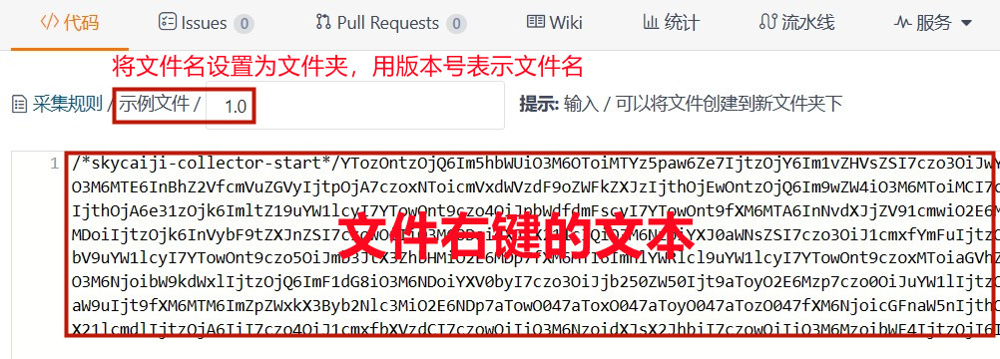

# 共享

共享规则和插件，欢迎上传分享作品！

>[rule 采集规则](/skycaiji/rule)

>>[上传采集规则](/skycaiji/rule/new/master)

>[func 函数插件](/skycaiji/func)

>>[上传函数插件](/skycaiji/func/new/master)

>[cms 发布插件](/skycaiji/cms)

>>[上传发布插件](/skycaiji/cms/new/master)

### 上传说明

仅支持上传.scj后缀文件的内容（采集器中导出至本地的文件）

打开上传链接，进入编辑界面，将需要上传的文件名称作为文件夹（不包含后缀），文件名使用版本号x.x代替（初始版本号1.0），例如：上传名称是“示例文件.scj”，在编辑界面的文件名中输入“文件示例/x.x”。然后右键编辑本地文件，将文本复制到内容中即可（或者您可以通过git命令提交），编辑界面如图：

注意：不要修改已经存在的文件！为了方便管理和存档，您仅能上传新的文件（任何修改行为都不会通过），以版本号来区分文件且版本号勿跨度太大，小修改在次版本号x.**X**上递增，大修改在主版本号**X**.x上递增

### 请勿上传违反法律法规的内容

